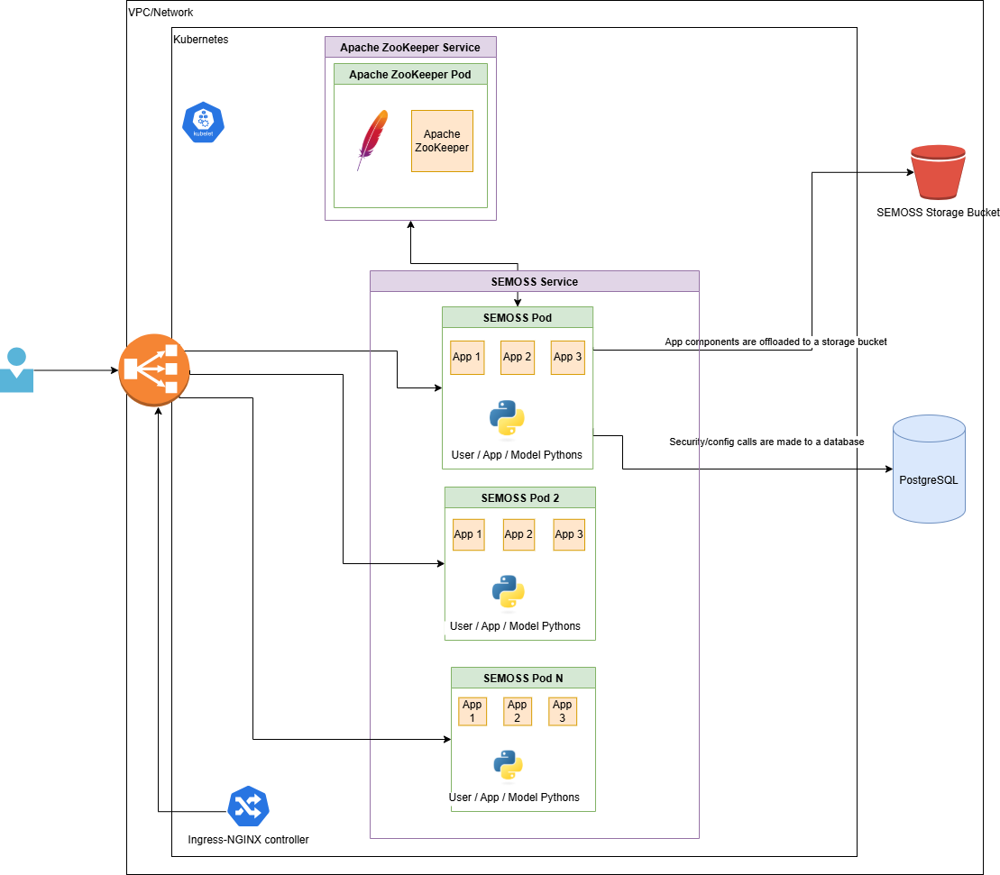

# SEMOSS Kubernetes deployment guide

> **Quick Navigation:** [Infrastructure requirements](#infrastructure-requirements) | [Database Setup](#database-configuration) | [Deploying Semoss to the Kubernetes cluster](#deploying-semoss-to-the-kubernetes-cluster) | [Exposing SEMOSS Overview](#exposing-semoss-to-the-outside-world) | [Ingress NGINX Retirement](#ingress-nginx-retirement)

## Infrastructure requirements

SEMOSS can be deployed as a service running in a Kubernetes cluster on a cloud provider. The SEMOSS deployment requires the following infrastructure resources:

- Kubernetes cluster
- Database (PostgreSQL)
- Storage bucket.

The following diagram details the Kubernetes and cloud provider resources that will be created.

<div align="center">
  <a href="kubernetes-deployment.png">
    
  </a>
  </br>
</div>

Before deploying the SEMOSS container, ensure that the pod has access to both the storage bucket (e.g., S3, Azure Blob, Google Bucket) and the database. Once the necessary policies are in place, the pods and services can be deployed to the Kubernetes cluster.

The details of these cloud resources will be passed to the SEMOSS pods as environment variables declared in the deployment YAML file.

## Database configuration

If you are using a managed database service, the following databases or schemas need to be created.

**Required Databases/Schemas:**

- security
- localmaster
- scheduler
- themes
- user_tracking
- model_logs
- prompt_hub

The names used for the schemas/databases can be changed to fit the project's naming standards.

If you are using a PostgreSQL database, you can use [psql](https://www.postgresql.org/docs/current/app-psql.html) to create the databases or schemas.

<details>
  <summary>psql installation:</summary>

- Install psql [Ubuntu](https://www.postgresql.org/download/linux/ubuntu/):

```bash
apt install postgresql
```

- Install psql [Amazon Linux 2023](https://docs.aws.amazon.com/AmazonRDS/latest/UserGuide/USER_ConnectToPostgreSQLInstance.html):

```bash
sudo dnf update -y
sudo dnf install postgresql -y
```

</details>

<details>
  <summary>Example of using psql to create databases in RDS:</summary>

> **Note:** An AWS RDS is used in the following commands, please check your cloud provider for instructions on how to connect to the database.

1.- Connect to database.

```bash
psql -h mydb.xxxxxxx.us-east-1.rds.amazonaws.com -p 5432 -U myuser -d postgres
```

2.- Once connected, run the following commands inside the prompt.

```bash
CREATE DATABASE <DATABASE_NAME>;
```

3.- To confirm the databases have been created:

```bash
\l
```

4.- To exit from the database

```bash
\q
```

</details>

Once SEMOSS pods are launched, they will connect to the databases and initialize tables upon its first launch.

## Deploying Semoss to the Kubernetes cluster

After the cluster has been created and connectivity to the blob storage and Database has been confirmed, SEMOSS can be deployed using the manifests listed in the [SEMOSS-deployment folder](./SEMOSS-deployment/). Please see the [deployment README](./SEMOSS-deployment/README.md) file for instructions on how to deploy it.

## Exposing SEMOSS to the Outside World

When you deploy an application in Kubernetes, it runs as a set of Pods managed by a Deployment. To enable communication between these Pods and other components within your cluster, you create a Kubernetes Service. However, Services alone don't provide external access to your applications—they only facilitate internal cluster networking.

Rather than creating multiple sevices of type **LoadBalancer** (one per application), Kubernetes provides higher-level resources that act as intelligent traffic routers. These resources sit in front of your Services and provide:

- Single LoadBalancer for multiple applications
- Centralized external access management
- Advanced Routing Capabilities

## Ingress NGINX Retirement

The recommended way to expose SEMOSS was to deploy the Ingress-NGINX controller but this controller will be retired and will enter in a Best-effort maintenance mode until March 2026.
Because of this we are moving from Ingress over to [Kubernetes Gateway](https://gateway-api.sigs.k8s.io/) since the project represents the next generation of Kubernetes Ingress, Load Balancing, and Service Mesh APIs.  

For diagrams and details comparing Ingress-NGINX with Kubernetes Gateway implementations/tools, see the [Gateway comparison](./docs/gateway-comparison-information.md) document.

<!-- ### Deployment Paths Available

For each tool, you'll see:

- HTTP deployment path - Basic external access without encryption
- HTTPS deployment path - Secure access with TLS certificate management

This guide is cloud-agnostic and its designed to work across cloud providers (AWS, Azure, Google Cloud). The principles and manifests remain consistent, only the LoadBalancer provisioning mechanism varies by infrastructure provider. -->

**Ready to deploy?** Start with [deploying the base SEMOSS application](./SEMOSS-deployment/README.md) →
