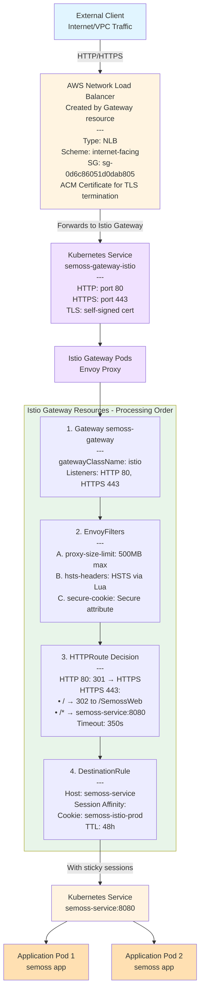

# Envoy Gateway Communication Flow Diagram
```
┌─────────────────────────────────────────────────────────────────────────┐
│                           EXTERNAL CLIENT                                │
│                         (Internet/VPC Traffic)                           │
└────────────────────────────────┬────────────────────────────────────────┘
                                 │
                                 │ HTTP (port 80) or HTTPS (port 443)
                                 │
                                 ▼
┌─────────────────────────────────────────────────────────────────────────┐
│                          AWS NETWORK LOAD BALANCER                       │
│                        (Created by Gateway resource)                     │
│  ┌────────────────────────────────────────────────────────────────┐    │
│  │ Annotations:                                                    │    │
│  │ - Type: NLB                                                     │    │
│  │ - Scheme: External (internet-facing)                            │    │
│  │ - Security Group: sg-xxxxxx                                     │    │
│  │ - ACM Certificate: Attached for TLS termination at NLB          │    │
│  └────────────────────────────────────────────────────────────────┘    │
└──────────────────────────┬──────────────────────────────────────────────┘
                           │
                           │ Forwards to Envoy Proxy Service
                           │
                           ▼
┌─────────────────────────────────────────────────────────────────────────┐
│                      KUBERNETES SERVICE (Envoy)                          │
│                 (envoy-semoss-envoy-gateway service)                     │
│                                                                           │
│  Listener Configuration:                                                 │
│  ├─ HTTP Listener (port 80)  ─────────────────────┐                     │
│  └─ HTTPS Listener (port 443)                     │                     │
│      └─ TLS Termination (self-signed cert)        │                     │
└───────────────────────────┬───────────────────────┼─────────────────────┘
                            │                       │
                            │                       │
              ┌─────────────▼───────────┐          │
              │   ENVOY PROXY POD(S)    │          │
              │  (Managed by Envoy      │          │
              │   Gateway Controller)   │          │
              └─────────────┬───────────┘          │
                            │                       │
                            │                       │
         ┌──────────────────┴───────────────────────┘
         │
         │ Request Processing Pipeline
         │
┌────────▼─────────────────────────────────────────────────────────────────┐
│                         ENVOY GATEWAY RESOURCES                           │
│                         (Applied in Processing Order)                     │
│                                                                            │
│  ┌──────────────────────────────────────────────────────────────────┐   │
│  │ 1. GatewayClass (envoy)                                           │   │
│  │    └─ Defines controller: gateway.envoyproxy.io/...              │   │
│  │       └─ Global scope, referenced by Gateway                      │   │
│  └──────────────────────────────────────────────────────────────────┘   │
│                                                                            │
│  ┌──────────────────────────────────────────────────────────────────┐   │
│  │ 2. Gateway (semoss-envoy-gateway)                                 │   │
│  │    └─ Creates LB with HTTP (80) and HTTPS (443) listeners        │   │
│  │    └─ Defines allowed routes from same namespace                 │   │
│  └──────────────────────────────────────────────────────────────────┘   │
│                                                                            │
│  ┌──────────────────────────────────────────────────────────────────┐   │
│  │ 3. ClientTrafficPolicy (Targets: Gateway)                         │   │
│  │    Applied BEFORE routing decisions                               │   │
│  │    ├─ Request body size limit: 500MB                              │   │
│  │    ├─ HSTS headers added to responses                             │   │
│  │    └─ Client idle timeout: 350s                                   │   │
│  └──────────────────────────────────────────────────────────────────┘   │
│                                                                            │
│  ┌──────────────────────────────────────────────────────────────────┐   │
│  │ 4. HTTPRoute Decision Tree                                         │   │
│  │                                                                     │   │
│  │    ┌─────────────────────────────────────────────────┐            │   │
│  │    │ A. HTTP Listener (port 80)                      │            │   │
│  │    │    HTTPRoute: semoss-https-redirect             │            │   │
│  │    │    └─ ALL HTTP traffic → 301 redirect to HTTPS │            │   │
│  │    └─────────────────────────────────────────────────┘            │   │
│  │                                                                     │   │
│  │    ┌─────────────────────────────────────────────────┐            │   │
│  │    │ B. HTTPS Listener (port 443)                    │            │   │
│  │    │    HTTPRoute: semoss-httproute-approot-redirect │            │   │
│  │    │                                                  │            │   │
│  │    │    Rule 1: Exact match "/"                      │            │   │
│  │    │    └─ 302 redirect to /SemossWeb                │            │   │
│  │    │                                                  │            │   │
│  │    │    Rule 2: PathPrefix "/"                       │            │   │
│  │    │    └─ Route to backend: semoss-service:8080     │            │   │
│  │    └─────────────────────────────────────────────────┘            │   │
│  └──────────────────────────────────────────────────────────────────┘   │
│                                                                            │
│  ┌──────────────────────────────────────────────────────────────────┐   │
│  │ 5. BackendTrafficPolicy (Targets: HTTPRoute)                      │   │
│  │    Applied AFTER routing decision, BEFORE backend                 │   │
│  │    ├─ Session affinity: Cookie-based (semoss-envoy-prod)          │   │
│  │    │   └─ TTL: 48h, Path: /, Secure                               │   │
│  │    └─ Connection idle timeout to backend: 350s                    │   │
│  └──────────────────────────────────────────────────────────────────┘   │
│                                                                            │
│  ┌──────────────────────────────────────────────────────────────────┐   │
│  │ 6. EnvoyExtensionPolicy (Targets: Gateway)                        │   │
│  │    Applied ON RESPONSE from backend                               │   │
│  │    └─ Lua script rewrites Set-Cookie paths                        │   │
│  │       (Path=/SemossWeb → Path=/)                                  │   │
│  └──────────────────────────────────────────────────────────────────┘   │
└────────────────────────────────┬───────────────────────────────────────┘
                                 │
                                 │ Routed traffic
                                 │
                                 ▼
┌─────────────────────────────────────────────────────────────────────────┐
│                    KUBERNETES SERVICE (semoss-service)                    │
│                              Port: 8080                                   │
│                       (Application Service)                               │
└────────────────────────────────┬────────────────────────────────────────┘
                                 │
                                 │ Load balanced to pods
                                 │
                    ┌────────────┴────────────┐
                    │                         │
                    ▼                         ▼
          ┌──────────────────┐      ┌──────────────────┐
          │  APPLICATION     │      │  APPLICATION     │
          │  POD 1           │      │  POD 2           │
          │  (semoss app)    │      │  (semoss app)    │
          └──────────────────┘      └──────────────────┘
```


# Install Envoy Gateway

The [Kubernetes Gateway API](https://gateway-api.sigs.k8s.io/) CRDs do not come installed by default on most Kubernetes clusters. To confirm if they have been installed run `kubectl api-resources | grep -i gateway.networking`

They can be installed if they are not present with the following command:
```bash
kubectl get crd gateways.gateway.networking.k8s.io &> /dev/null || \
  { kubectl kustomize "github.com/kubernetes-sigs/gateway-api/config/crd?ref=v1.4.1" | kubectl apply -f -; }
  ```

> **Note:** Please check the [GitHub project](https://github.com/kubernetes-sigs/gateway-api/) page for the latest release version.

Although the Kubernetes Gateway CRDs are already installed, please note that Envoy CRDs are in a separate helm chart so to be able to use resources like **EnvoyPatchPolicy** the following chart needs to be installed:
```
helm template eg oci://docker.io/envoyproxy/gateway-crds-helm \
  --version v1.6.2 \
  --set crds.gatewayAPI.enabled=false \
  --set crds.gatewayAPI.channel=standard \
  --set crds.envoyGateway.enabled=true \
  | kubectl apply --server-side -f -
```

This is the explanation behind the settings used in the previous command: 
- crds.gatewayAPI.enabled=<true|false>  => Installs standard Gateway API CRDs
- crds.gatewayAPI.channel=<standard|experimental> => installs from standard or experimental Channels
- crds.envoyGateway.enabled=<true|false> => Installs Envoy-specific CRDs


The `kubectl apply --server-side -f -` is used tp avoid a known size issue with deploying CRDs with helm (invalid: metadata.annotations: Too long: may not be more than 262144 bytes).

To confirm that the Envoy CRDs were installed run `kubectl api-resources | grep -i gateway.envoyproxy`. The following are the CRDs that get deployed:
- backends.gateway.envoyproxy.io
- backendtrafficpolicies.gateway.envoyproxy.io
- clienttrafficpolicies.gateway.envoyproxy.io
- envoyextensionpolicies.gateway.envoyproxy.io
- envoypatchpolicies.gateway.envoyproxy.io
- envoyproxies.gateway.envoyproxy.io
- httproutefilters.gateway.envoyproxy.io
- securitypolicies.gateway.envoyproxy.io


Once the Envoy CRDs have been deployed, install Envoy Gateway with helm by running the following command:
```bash
helm install eg oci://docker.io/envoyproxy/gateway-helm \
  --version v1.6.2 \
  -n envoy-gateway-system \
  --create-namespace \
  --skip-crds
```

> **Note:** If needed, add the `--set config.envoyGateway.extensionApis.enableEnvoyPatchPolicy=true` flag to [enable the Envoy Gateway's backend API](https://github.com/envoyproxy/gateway/issues/7458) in the "envoy-gateway-config" ConfigMap so Envoy patch policies can be applied to the Gateway resources.

## Deploying the Envoy Gateway manifests


Envoy's gateway class is not created by default and the default  in the envoy-gateway-system namespace does not allow envoy polcy patches at the gateway resource. The HSTS headers need to have the following code added to the envoy-gateway-config for the HSTS headers to be added to all responses and not to only one single httproute:
```bash
extensionApis:
      enableEnvoyPatchPolicy: true  # ← Add this line
```

The progress can be checked with:
```bash
helm status eg -n envoy-gateway-system
```

For the most recent Envoy install commands please go to [Envoy Gateway helm install document](https://gateway.envoyproxy.io/docs/install/install-helm/) and for the latest version see the [GitHub project](https://github.com/envoyproxy/gateway) page.

## Creating the Gateway class

Envoy's gateway class is not created by default 

# Resource Relationship Diagram
```
                    ┌─────────────────────┐
                    │   GatewayClass      │
                    │     (envoy)         │
                    └──────────┬──────────┘
                               │ references
                               │
                    ┌──────────▼──────────┐
            ┌───────┤      Gateway        ├───────┐
            │       │ (semoss-envoy-      │       │
            │       │      gateway)       │       │
            │       └─────────────────────┘       │
            │                                      │
    targeted by                            targeted by
            │                                      │
┌───────────▼────────────┐          ┌──────────────▼─────────────┐
│ ClientTrafficPolicy    │          │ EnvoyExtensionPolicy       │
│ - Body size: 500MB     │          │ - Cookie path rewrite      │
│ - HSTS headers         │          │   (Lua script)             │
│ - Idle timeout: 350s   │          └────────────────────────────┘
└────────────────────────┘
                               
                    ┌─────────────────────┐
            ┌───────┤     HTTPRoute       ├───────┐
            │       │ (approot-redirect)  │       │
            │       └─────────────────────┘       │
            │                │                     │
    parent ref to     routes to              targeted by
       Gateway       semoss-service               │
            │                                      │
            │                         ┌────────────▼────────────┐
            │                         │ BackendTrafficPolicy    │
            │                         │ - Session affinity      │
            │                         │ - Upstream idle: 350s   │
            │                         └─────────────────────────┘
            │
            │       ┌─────────────────────┐
            └───────┤     HTTPRoute       │
                    │ (https-redirect)    │
                    └─────────────────────┘
                         (redirects HTTP→HTTPS)
```


# Uninstall Envoy Gateway

To uninstall the Envoy CRDs:
```
helm template eg-crds oci://docker.io/envoyproxy/gateway-crds-helm \
  --version v1.6.2 \
  --set crds.gatewayAPI.enabled=false \
  --set crds.gatewayAPI.channel=standard \
  --set crds.envoyGateway.enabled=true \
  | kubectl delete -f -
```

To uninstall envoy `helm uninstall eg -n envoy-gateway-system`

