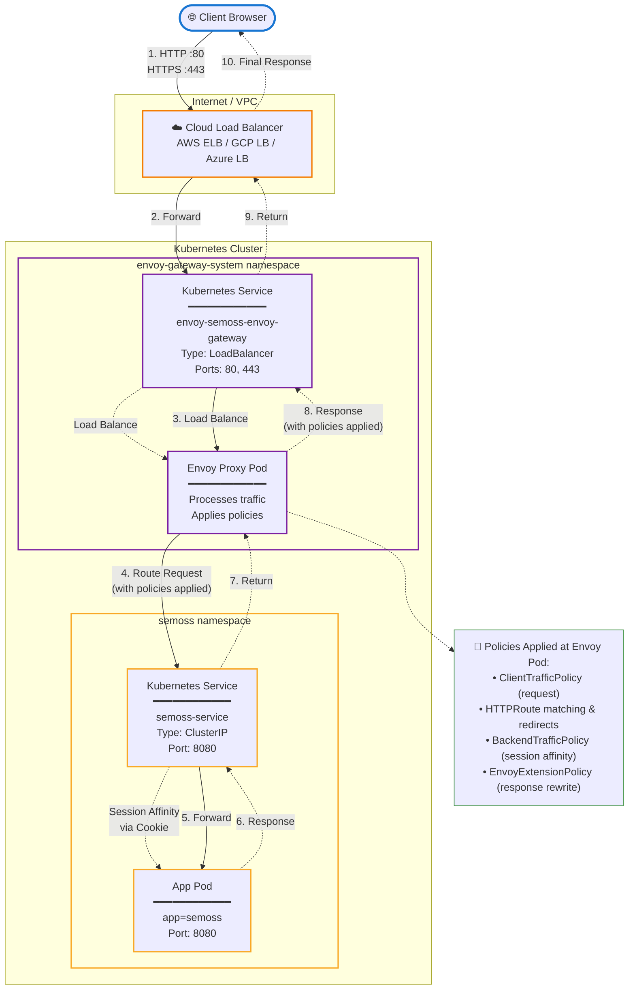

# Envoy Gateway Deployment Guide

## Overview

Envoy Gateway provides the following benefits:

- **100% Open Source** - No paid subscription needed
- **Cloud Agnostic** - Works on any Kubernetes cluster
- **Gateway API Native** - Purpose-built for the Kubernetes Gateway API standard
- **Lightweight** - Standalone gateway without service mesh overhead
- **No Application Changes** - Works with existing applications

## Architecture & Traffic Flow



## Prerequisites

### Kubernetes Gateway API CRDs

The Kubernetes Gateway API CRDs do not come installed by default on most Kubernetes clusters. Install them with the following command:

```bash
kubectl get crd gateways.gateway.networking.k8s.io &> /dev/null || \
  { kubectl kustomize "github.com/kubernetes-sigs/gateway-api/config/crd?ref=v1.4.0" | kubectl apply -f -; }
```

**CRDs that will be installed:**

- backendtlspolicies.gateway.networking.k8s.io
- gatewayclasses.gateway.networking.k8s.io
- gateways.gateway.networking.k8s.io
- grpcroutes.gateway.networking.k8s.io
- httproutes.gateway.networking.k8s.io
- referencegrants.gateway.networking.k8s.io

**Verify installation:**

```bash
kubectl api-resources | grep -i gateway.networking
```

> **Note:** Latest gateway-api CRD API list and release version can be found on the [project's](https://github.com/kubernetes-sigs/gateway-api) repository.

### Envoy Gateway CRDs

Envoy Gateway requires its own CRDs to be installed separately. Install them with:

```bash
helm template eg oci://docker.io/envoyproxy/gateway-crds-helm \
  --version v1.6.2 \
  --set crds.gatewayAPI.enabled=false \
  --set crds.gatewayAPI.channel=standard \
  --set crds.envoyGateway.enabled=true \
  | kubectl apply --server-side -f -
```

**CRDs that will be installed:**

- backends.gateway.envoyproxy.io
- backendtrafficpolicies.gateway.envoyproxy.io
- clienttrafficpolicies.gateway.envoyproxy.io
- envoyextensionpolicies.gateway.envoyproxy.io
- envoypatchpolicies.gateway.envoyproxy.io
- envoyproxies.gateway.envoyproxy.io
- httproutefilters.gateway.envoyproxy.io
- securitypolicies.gateway.envoyproxy.io

**Verify installation:**

```bash
kubectl api-resources | grep -i gateway.envoyproxy
```

## Installation

Install Envoy Gateway using Helm:

```bash
helm install eg oci://docker.io/envoyproxy/gateway-helm \
  --version v1.6.2 \
  -n envoy-gateway-system \
  --create-namespace \
  --skip-crds
```

## What's Deployed?

After installation, the following Envoy Gateway components are deployed to the envoy-gateway-system namespace:

**✅ Installed:**

- Envoy Gateway controller (control plane)
- Gateway API support

**❌ Not Installed:**

- GatewayClass resource
- Gateway instances (created when you deploy a Gateway resource)
- Monitoring/telemetry addons

---

## Next Step: Expose Your Application

With Envoy Gateway installed, you're ready to expose your application by creating a Gateway resource. The Gateway creates a LoadBalancer that routes external traffic to your application.

**Choose Your Path:**

**[HTTP Deployment →](./http-deployment/README.md)**  
Basic external access without encryption (single HTTP listener on port 80)

**[HTTPS Deployment →](./https-deployment/README.md)**  
Secure access with TLS certificate management (HTTPS listener on port 443 + optional HTTP redirect)

> **Note:** Both paths create a LoadBalancer Service—the difference is in the Gateway's listener configuration and certificate management.


---
**← Back to [Main Guide](../README.md)**
