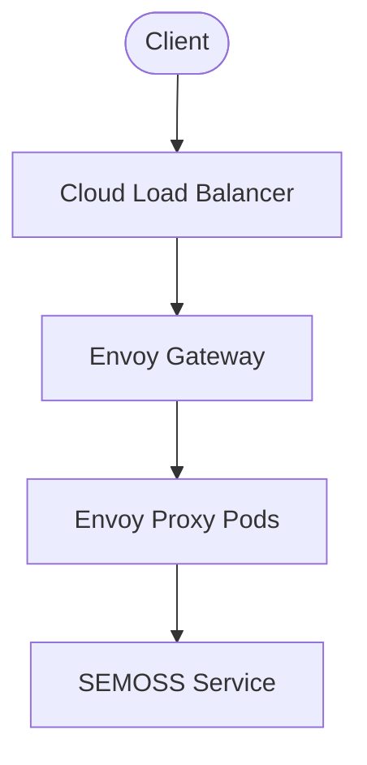

# Envoy Gateway Deployment Template

## Overview

This repository provides a template for exposing the SEMOSS service using Envoy Gateway on Kubernetes.

**Key Benefits:**

- **Gateway API Native** - Built for the Kubernetes Gateway API standard
- **Separation of Concerns** - Shared infrastructure resources + per-application routing configs
- **Path-based Routing** - Path-based routing behind a single load balancer
- **Traffic control** - Includes session affinity, traffic policies, and extension policies

## Traffic Flow


```mermaid
graph TB
    Client([Client])
    LB[Cloud Load Balancer]
    Gateway[Envoy Gateway]
    Envoy[Envoy Proxy Pods]
    App[SEMOSS Service]
    
    Client --> LB
    LB --> Gateway
    Gateway --> Envoy
    Envoy --> App
```

**Flow:**

- Traffic hits cloud load balancer
- Load balancer forwards to Envoy Gateway service
- Envoy proxies apply policies (ClientTrafficPolicy, BackendTrafficPolicy, EnvoyExtensionPolicy)
- HTTPRoutes determine which application receives the request
- Traffic routes to SEMOSS service

### Repository Structure
```bash
infrastructure/                 # Shared cluster-level resources
├── 01-gateway-class            # Defines the gateway implementation
├── 02-gateway                  # Creates LoadBalancer
├── 03-httproutes               # Global listeners (e.g., HTTPS redirect)
├── 04-clienttrafficpolicies    # Client-side policies (e.g. Request Body Size Limits, HSTS and IddleTimeOut)
└── 05-envoyextensionpolicies   # Cookie Path Rewrite

examples/                       # Application routing templates (copy & customize)
├── root-path-routing/          # Single app at root path (/)
│   ├── 01-httproutes              # HTTP redirects
│   └── 02-backendtrafficpolicies  # Session Affinity and Proxy timeout
└── path-based-routing/         # Multiple apps with path prefixes (/api, /web)
    ├── 01-httproutes
    └── 02-backendtrafficpolicies
```


## How to use

- Deploy infrastructure/ (Can be a single deployment per cluster)
- Copy either root-path-routing/ or path-based-routing/ from examples/
- Customize the copied resources for your SEMOSS environment.

## Prerequisites

### Kubernetes Gateway API CRDs

The Kubernetes Gateway API CRDs do not come installed by default on most Kubernetes clusters. Install them with the following command:

```bash
kubectl get crd gateways.gateway.networking.k8s.io &> /dev/null || \
  { kubectl kustomize "github.com/kubernetes-sigs/gateway-api/config/crd?ref=v1.4.0" | kubectl apply -f -; }
```

**CRDs that will be installed:**

- backendtlspolicies.gateway.networking.k8s.io
- gatewayclasses.gateway.networking.k8s.io
- gateways.gateway.networking.k8s.io
- grpcroutes.gateway.networking.k8s.io
- httproutes.gateway.networking.k8s.io
- referencegrants.gateway.networking.k8s.io

**Verify installation:**

```bash
kubectl api-resources | grep -i gateway.networking
```

> **Note:** Latest gateway-api CRD API list and release version can be found on the [project's](https://github.com/kubernetes-sigs/gateway-api) repository.

### Envoy Gateway CRDs

Envoy Gateway requires its own CRDs to be installed separately. Install them with:

```bash
helm template eg oci://docker.io/envoyproxy/gateway-crds-helm \
  --version v1.6.2 \
  --set crds.gatewayAPI.enabled=false \
  --set crds.gatewayAPI.channel=standard \
  --set crds.envoyGateway.enabled=true \
  | kubectl apply --server-side -f -
```

**CRDs that will be installed:**

- backends.gateway.envoyproxy.io
- backendtrafficpolicies.gateway.envoyproxy.io
- clienttrafficpolicies.gateway.envoyproxy.io
- envoyextensionpolicies.gateway.envoyproxy.io
- envoypatchpolicies.gateway.envoyproxy.io
- envoyproxies.gateway.envoyproxy.io
- httproutefilters.gateway.envoyproxy.io
- securitypolicies.gateway.envoyproxy.io

**Verify installation:**

```bash
kubectl api-resources | grep -i gateway.envoyproxy
```

## Installation

Install Envoy Gateway Controller using Helm:

```bash
helm install eg oci://docker.io/envoyproxy/gateway-helm \
  --version v1.6.2 \
  -n envoy-gateway-system \
  --create-namespace \
  --skip-crds
```

## What's Deployed?

After installation, the following Envoy Gateway components are deployed to the envoy-gateway-system namespace:

**✅ Installed:**

- Envoy Gateway controller (control plane)
- Gateway API support

**❌ Not Installed:**

- GatewayClass resource
- Gateway instances (created when you deploy a Gateway resource)
- Monitoring/telemetry addons

## Deploy Infrastructure Resources

```Bash
# Deploy in order
kubectl apply -f infrastructure/01-gateway-class/
kubectl apply -f infrastructure/02-gateway/
kubectl apply -f infrastructure/03-httproutes/
kubectl apply -f infrastructure/04-clienttrafficpolicies/
kubectl apply -f infrastructure/05-envoyextensionpolicies/
```

Wait for Gateway to get an external IP:

```Bash
kubectl get gateway -n <namespace> -w
```

**Deploy Your Application Routes**
Choose the appropriate pattern:
For single application at root path:

```Bash
cp -r examples/root-path-routing/ SEMOSS-envoy/
# Edit files in SEMOSS-envoy-routes/ to match environment
kubectl apply -f SEMOSS-envoy/
```

For multiple applications with path-based routing:

```Bash
cp -r examples/path-based-routing/ SEMOSS-envoy/
# Edit files in SEMOSS-envoy/ to match your environment
kubectl apply -f SEMOSS-envoy/
```

### Key Configuration Points

When customizing the examples for your environment:

- HTTPRoute - Update spec.parentRefs to reference your Gateway, set your path matching rules
- BackendTrafficPolicy - Update spec.targetRefs to reference your HTTPRoute
- Namespace - All resources should be in your environment's namespace

### Troubleshooting

Gateway stuck in Pending:

```Bash
kubectl describe gateway <gateway-name> -n <namespace>
```

HTTPRoute not routing traffic:

```Bash
kubectl describe httproute <route-name> -n <namespace>
```

Check Envoy proxy logs:

```Bash
kubectl logs -n envoy-gateway-system -l gateway.envoyproxy.io/owning-gateway-name=<gateway-name>
```

### Additional Resources

- [Envoy Gateway Documentation](https://gateway.envoyproxy.io/docs/)
- [Kubernetes Gateway API](https://gateway-api.sigs.k8s.io/)
- [Envoy Gateway Releases](https://github.com/envoyproxy/gateway/releases)
- [Kubernetes Gateway Releases](https://github.com/kubernetes-sigs/gateway-api/releases)