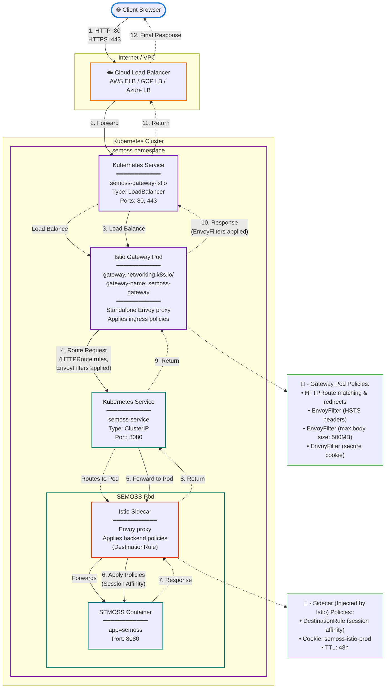

# Istio Gateway Deployment Guide

## Overview

Istio provides the following benefits:

- 100% Open Source - No paid subscription needed
- Cloud Agnostic - Works on any Kubernetes cluster
- Cookie-based Session Affinity - Supported via consistentHash in DestinationRule
- No Application Changes - Handles session cookies at the proxy level

Istio **with** [Kubernetes Gateway API](https://gateway-api.sigs.k8s.io/) provides the following benefits:

- Vendor Neutrality - Same API works with Istio, Envoy Gateway, Kong, etc.
- Simplified Configuration - HTTPRoute is more intuitive than VirtualService
- Future-Proof - Gateway API is the Kubernetes standard for ingress
- Automatic Gateway Deployment - No need to manually deploy ingress gateways sidecar deployment.

## Architecture & Traffic Flow



## Prerequisites

### Kubernetes Gateway API CRDs

The Kubernetes Gateway API CRDs do not come installed by default on most Kubernetes clusters. Install them with the following command:

```bash
kubectl get crd gateways.gateway.networking.k8s.io &> /dev/null || \
  { kubectl kustomize "github.com/kubernetes-sigs/gateway-api/config/crd?ref=v1.4.0" | kubectl apply -f -; }
```

#### CRDs that will be installed:

- backendtlspolicies.gateway.networking.k8s.io
- gatewayclasses.gateway.networking.k8s.io
- gateways.gateway.networking.k8s.io
- grpcroutes.gateway.networking.k8s.io
- httproutes.gateway.networking.k8s.io
- referencegrants.gateway.networking.k8s.io

#### Verify installation:

```bash
kubectl api-resources | grep -i gateway.networking
```

> **Note:** Latest gateway-api CRD API list and release version can be found on the [project's](https://github.com/kubernetes-sigs/gateway-api) repository.


### Istioctl CLI

To manage Istio install the [Istioctl](https://istio.io/latest/docs/setup/install/istioctl/) CLI which will be used to deploy it to the cluster.

### Installation

Install Istio using the minimal profile using [istioctl](https://istio.io/latest/docs/ops/diagnostic-tools/istioctl/):

```bash
istioctl install --set profile=minimal -y
```

Installation can be verified with:

```bash
kubectl -n istio-system get all
```

#### What's Deployed?

After installation, the following Istio components are deployed to the istio-system namespace:

**✅ Installed:**

- Istiod (control plane)
- Gateway API CRDs and controller support

**❌ Not Installed:**

- Ingress Gateway (we use Gateway API resources instead)
- Egress Gateway
- Telemetry addons (Prometheus, Grafana, Kiali)

---

## Next Step: Expose Your Application

With Istio installed, you're ready to expose the app application. This process involves two steps:

1. **Enable Istio sidecar injection** for your application pods
2. **Create a Gateway resource** to route external traffic

### Step 1: Enable Istio Sidecar Injection

The Istio sidecar proxy must be injected into your application pod to enable Istio's traffic management features (session affinity, security policies, etc.).

**Two approaches for enabling sidecar injection:**

#### Option A: Namespace-Level Injection (Recommended for single-app namespaces)

Enable sidecar injection for all pods in the namespace by adding the **istio-injection: enabled** label:

```yaml
apiVersion: v1
kind: Namespace
metadata:
  name: semoss
  labels:
    istio-injection: enabled
```

> Note: All pods in this namespace will receive an Istio sidecar, including any supporting services (e.g., Zookeeper, databases).

#### Option B: Pod-Level Injection (Recommended when selective injection is needed)

If your deployment includes multiple pods but only one needs Istio features (e.g., your main app needs the Gateway, but Zookeeper doesn't), add the label to specific deployment pod templates. Since we do not explicitly need the zookeper pod to have an Istio side car, we are adding the label to the deployment yaml:

```yaml
apiVersion: apps/v1
kind: Deployment
metadata:
  labels:
    app.kubernetes.io/name: semoss
  name: semoss
  namespace: semoss
spec:
  replicas: 1
  selector:
    matchLabels:
      app.kubernetes.io/instance: semoss
      app.kubernetes.io/name: semoss
  strategy:
    type: Recreate
  template:
    metadata:
      labels:
        app.kubernetes.io/instance: semoss
        app.kubernetes.io/name: semoss
        sidecar.istio.io/inject: "true" # Enable Istio sidecar injection
```

**Verify sidecar injection:**

```bash
# Check that the pod has 2 containers (app + istio-proxy)
kubectl get pods -n app-namespace

# Example output:
# NAME                    READY   STATUS    RESTARTS   AGE
# app-deployment-abc123   2/2     Running   0          30s
#                         ↑
#              2 containers = app + sidecar
```

### Step 2: Create the Gateway

Now that your application has the Istio sidecar, choose your deployment path to create the Gateway resource:

- **[HTTP Deployment](./http-deployment/) →**
Basic external access without encryption (single HTTP listener on port 80)

- **[HTTPS Deployment](./https-deployment/) →**
Secure access with TLS certificate management (HTTPS listener on port 443 + optional HTTP redirect)

> **Note:** Both paths create a LoadBalancer Service — the difference is in the Gateway's listener configuration and certificate management.

---
**← Back to [Main Guide](../README.md)**
